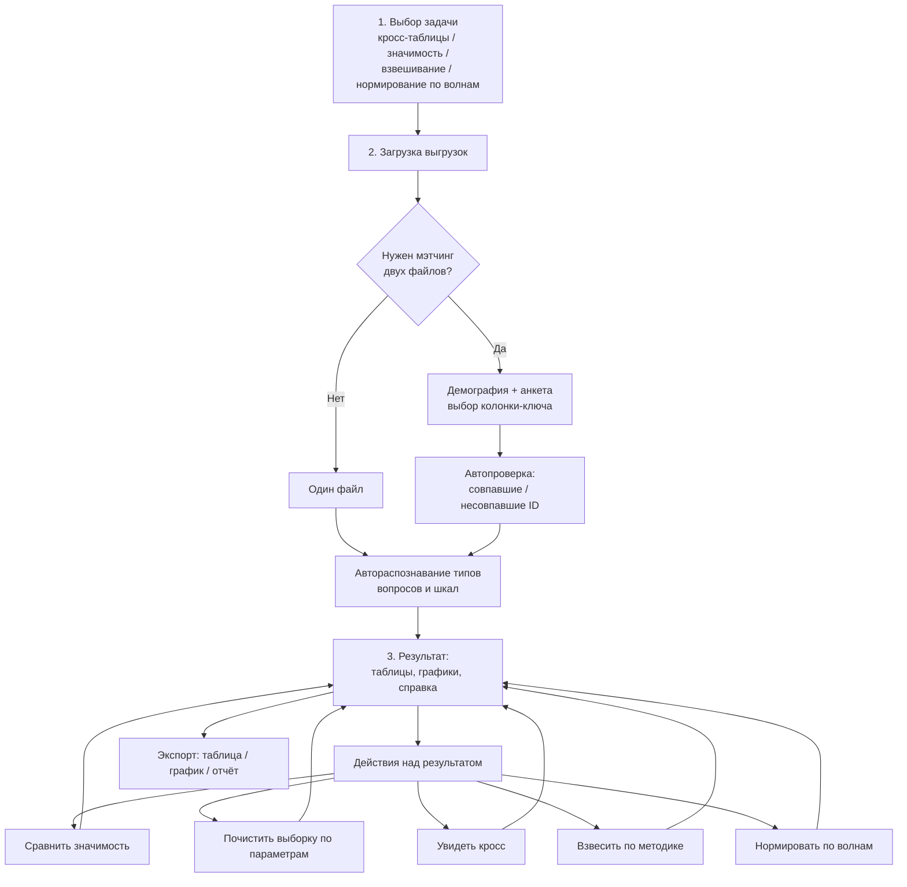

# ТЗ: веб-сервис количественной обработки данных (jamovi-style)

2026-09-17 · @Someone

Цель — веб-инструмент для самостоятельной количественной обработки типовых выгрузок (без знания статистики и Python), по образцу jamovi: выбор задачи → загрузка данных → результат с управляемыми действиями, каждое из которых сопровождается краткой справкой и наглядной визуализацией изменений.

## Частые типы количественных задач

Анализ реальных проектов Дискавери (концепт-тесты, MaxDiff, Kano, сегментация, вейв-исследования, CFA/SEM) показывает устойчивый набор задач, которые повторяются от проекта к проекту почти в неизменном виде. Именно этот набор и должен покрыть сервис в первую очередь.

| Задача | Что делает исследователь сейчас (Python/R вручную) | Частота |
| --- | --- | --- |
| Очистка выборки | Отсев по времени прохождения, straight-lining, дублям id/паспорту, специальным вопросам-ловушкам, полноте ответов | Почти в каждом проекте |
| Описательная статистика и частоты | Частотки по вопросам, средние/медианы по шкалам, доли по категориям | Почти в каждом проекте |
| Кросс-таблицы (перекрёстные распределения) | Разбивка любого вопроса по демографии/группам сравнения, % по строке/столбцу | Почти в каждом проекте |
| Тесты значимости различий | Сравнение долей/средних между группами (Хи-квадрат, z-тест долей, t-тест/ANOVA), в т.ч. между концептами в сплит-дизайне | Почти в каждом проекте (концепт-тесты, сплиты, wave-over-wave) |
| Взвешивание выборки | RIM/рим-взвешивание, cell-weighting по полу/возрасту/городу/оператору под генеральную совокупность или квоты | Регулярно, когда выборка панельная непропорциональная |
| Нормирование по волнам | Приведение шкал/баллов к сопоставимому виду между волнами замера (напр. индекс прогрессивности, NPS/CSI трекинг) | В трекинговых и wave-over-wave проектах |
| Сборка сводного индекса/шкалы | Свёртка батареи Matrix-вопросов в индекс (напр. средний по 10 утверждениям на концепт), проверка надёжности (альфа Кронбаха) | В концепт-тестах с батареями утверждений |
| MaxDiff-анализ | Расчёт важности/полезности атрибутов по MaxDiff-заданиям | В проектах приоритизации фич/атрибутов |
| Kano-анализ | Классификация фич по категориям Kano (must-be, performance, attractive и т.д.) | В проектах приоритизации фич |
| Ранжирование концептов/сегментов | Сортировка по ключевой метрике с доверительными интервалами, ранги с учётом значимости | В мультиконцептных тестах (3+ группы, ротация) |
| Сегментация | Кластеризация респондентов по паттерну ответов (K-means, LCA) | В части проектов (household, аудиторные сегменты) |
| Регрессия/драйверный анализ | Влияние отдельных атрибутов на итоговую метрику (напр. на готовность подключиться) | В части проектов |
| Анализ открытых вопросов | Частотный/тематический разбор open-end и "Other (text)" ответов | Регулярно |

Сервис в MVP должен закрыть верхние 6–7 строк таблицы — это ежедневная рутина, которая отнимает больше всего времени именно у людей без количественной подготовки. MaxDiff, Kano, сегментацию и регрессию логично вынести в расширение (см. раздел «Этапы разработки»).

## Типы и форматы выгрузок

Структура взята из реальных файлов в папках проектов (напр. «2026-09-16 Тест гипотез beeGPT») — два устойчивых типа выгрузки, которые нужно уметь мэтчить между собой.

**1. Выгрузка панели/демографии (Enjoy и аналоги)**. Excel, один лист `BASE`. Строка 1 — техническое имя переменной (`Qgender`, `Qage`, …), строка 2 — текст вопроса, дальше данные. Ключевые поля: `id` (внутренний ID респондента — ключ мэтчинга), `ac` (access code), `status` (complete/screened — фильтр валидных), `starttime`/`endtime`/`surveytime` (для отсева по времени прохождения), демографические `Q*`-переменные (пол, возраст, город, оператор и т.д.).

**2. Выгрузка основной анкеты (платформа сбора)**. Excel, лист `Report`, широкий формат (до 100+ столбцов). Особенности, которые парсер должен распознавать автоматически:

- `URL Tag: ID` — внешний ID для мэтчинга с выгрузкой демографии;
- **Choice-вопросы (multiple choice)** — один столбец на каждый вариант ответа (True/False), иногда + отдельный столбец `Other (text)`;
- **Single choice** — один столбец с текстоответом + опциональный `, other answers`;
- **Matrix-батареи** — набор повторяющихся утверждений (напр. 10 шт. «Мне нравится…», «Я воспользуюсь…») на каждый из N оцениваемых объектов (концептов/тарифов), значения — текстовая 5–балльная шкала согласия («Полностью согласен(а)» … «Ни то, ни другое»), блоки пронумерованы порядковым номером вопроса (8, 9, 10…), а не номером концепта, который респондент видел реально (порядок ротирован);
- `Shuffle order` / отдельный столбец с группой (`A`/`B`/`C`) — порядок/версия предъявления, нужен для корректного сопоставления концептов между группами;
- служебные поля (`Status`, `Completion time, s`, `Device`, `Device OS`, `Source`, `Reward`) — для технической чистки.

**Мэтчинг**: когда загружены оба файла — связка по ID (`id` из выгрузки демографии = `URL Tag: ID` из основной анкеты, точное имя поля может отличаться между платформами, поэтому нужен выбор колонки-ключа вручную). Сервис должен также уметь работать только с одной выгрузкой, если мэтчинг не нужен.

**Форматы файлов**: `.xlsx` как основной, с поддержкой `.csv`. Структура шапок и имена колонок варьируются между платформами сбора — парсер должен быть настраиваемым (пользователь указывает типы столбцов на экране предпросмотра), а не жёстко привязан к одной платформе.

## Пользовательский флоу

Сквозной сценарий — от выбора задачи до итеративной работы с результатом, без перезагрузки данных на каждом шаге.

Ключевой принцип шага 3 — цикличность: любое действие (очистка, взвешивание, фильтр) возвращает на обновлённый результат, а не в отдельный экран без возврата.

## Шаг 1 — выбор задачи

Стартовый экран — галерея из карточек задач (по мотиву jamovi/modules), не выпадающий список методов. Для MVP — шесть карточек из таблицы выше (очистка, описательная статистика, кросс-таблицы, значимость, взвешивание, нормирование по волнам).

Каждая карточка содержит:

- название задачи на простом языке (не «Хи-квадрат», а «Сравнить две группы респондентов»);
- одно-два предложения о том, для какого вопроса это подходит («есть ли различия между группами?», «какая выборка у меня?»);
- требуемый вход данных (один файл / два файла с мэтчингом / несколько волн).

Выбор задачи задаёт контекст для шага 2: система заранее знает, сколько файлов запрашивать и какие вопросы задать при загрузке (например, для взвешивания — сразу спросить про целевые доли по генеральной совокупности).

Задачи вне MVP (MaxDiff, Kano, сегментация, регрессия, анализ открытых вопросов) показываются в том же списке с меткой «скоро», чтобы карта возможностей была видна сразу.

## Шаг 2 — загрузка и мэтчинг

1. **Загрузка файла(ов)** — drag-n-drop `.xlsx`/`.csv`. Если задача требует два файла — два отдельных слота («Демография», «Основная анкета»).
2. **Автораспознавание структуры**: сервис определяет строку с именами переменных, строку с текстом вопроса (если есть), границу данных, тип каждого столбца (числовой / категориальный текст / boolean-ответ на вариант / свободный текст). Матричные батареи автоматически группируются по номеру вопроса, текстовые шкалы согласия конвертируются в числовой код по редактируемому словарю («Полностью согласен» = 5 … «Полностью не согласен» = 1).
3. **Превью и подтверждение**: таблица с первыми 5–10 строками и определёнными типами колонок — пользователь может вручную переопределить тип или исключить столбец из анализа (технические поля типа `Device`, `Browser`).
4. **Мэтчинг двух файлов** (если загружены оба): сервис предлагает кандидатов на колонку-ключ в каждом файле (по имени — `id`, `ID`, `URL Tag: ID` — или по совпадению значений), пользователь подтверждает пару. После мэтча показывается сводка: сколько записей совпало, сколько осталось без пары в каждом файле, с возможностью скачать список несовпавших ID для проверки.
5. **Фильтр по `status`**: по умолчанию в анализ идут только `complete`/`completed`, остальные статусы (screened, незавершённые) показываются отдельно с возможностью включить.
6. **Несколько волн** (для нормирования): загрузка нескольких файлов с меткой волны (вручную или по имени файла/дате).

Вся грубая чистка (удаление строк-заголовков, приведение типов) происходит автоматически на этом шаге; тонкая чистка выборки (по параметрам) — уже действие в шаге 3.

## Шаг 3 — модули обработки

Результат — единый экран с базовой таблицей/графиком и панелью действий сбоку. Каждое действие применяется как фильтр/трансформация поверх текущего состояния и отображается в одном месте, без отдельных экранов.

**Сравнить значимость**

- Выбор двух и более групп (по любой категориальной переменной или волнам) и метрики для сравнения.
- Автовыбор теста по типу данных: доли/категории → z-тест для двух групп или Хи-квадрат для 3+; средние по шкале → t-тест для двух групп или ANOVA для 3+ (с post-hoc при значимости).
- Результат: p-value, величина эффекта (Cramer's V / Cohen's d), цветовая маркировка значимых различий прямо в таблице (стрелки вверх/вниз — принятая нотация в отрасли).
- Справка: что такое p-value и почему 0,05, когда тест некорректен (малые ячейки).

**Почистить выборку**

- Фильтры по любым переменным (демография, статус, время прохождения) с живым пересчётом N после каждого шага.
- Готовые пресеты: слишком быстрое прохождение (ниже порога в секундах/перцентиле), straight-lining в матричных блоках (одинаковый ответ по всем утверждениям), непройдённые вопросы-ловушки.
- Каждый пресет показывает превью: сколько записей будет удалено, до подтверждения. История применённых фильтров видна и обратима (undo).

**Увидеть кросс**

- Любой вопрос × любая группирующая переменная, переключение % по строке/столбцу/общему, вывод N и %.
- Автоматическая подсветка ячеек с N < 30 (ненадёжная оценка) и связь с блоком «Сравнить значимость» одним кликом.
- Экспорт кросса в Excel в виде, готовом для вставки в отчёт.

**Взвесить по методике**

- Способы: квотное взвешивание (cell weighting) по одной-двум переменным и RIM/iterative proportional fitting по нескольким переменным одновременно.
- Целевые доли задаются вручную или загружаются из файла генеральной совокупности.
- Обязательная диагностика после взвешивания: design effect и эффективный N, диапазон весов (min/max/средний), предупреждение при экстремальных весах (итеративный алгоритм не сошёлся).
- Сравнение до/после взвешивания одним кликом.

**Нормировать по волнам**

- Сопоставление одной метрики/индекса между волнами с указанием динамики (точка роста/падения, доверительный интервал).
- При разной методологии сбора между волнами — предупреждение о несопоставимости (например, разные шкалы или формулировки вопроса).
- Тест значимости разницы между волнами (аналогично блоку «Сравнить значимость», где вместо групп — волны).

Все действия комбинируются: чистка → взвешивание → кросс/значимость на взвешенных данных — без повторной загрузки.

## Наглядность и встроенная справка

Главное отличие от работы в R/Python — пользователь без количественной подготовки должен понимать не только «что получилось», но и «что это значит». Принцип сквозной для всех модулей шага 3:

1. **Карточка-пояснение над каждым результатом**: 2—3 предложения простым языком — что сделал метод, как читать число, что означает конкретный результат (не общая теория, а интерпретация именно этих чисел).
2. **Развёрнутая справка по запросу** (иконка «?»): для чего метод, когда применим/не применим, какие у него ограничения (например: Хи-квадрат ненадёжен при ожидаемых частотах < 5; взвешивание не исправит систематические смещения выборки, только состав по известным параметрам).
3. **Цветовое/графическое кодирование значимости** прямо в таблицах и графиках (без отдельной таблицы p-values) — читаться без статистической подготовки.
4. **Журнал действий** в боковой панели: каждый применённый шаг («filtered: возраст 18–24», «weighted by пол × возраст») виден как отдельная строка с возможностью отката; это же — основа для воспроизводимости анализа.
5. **Сравнение «до/после»**: любое действие, меняющее данные (чистка, взвешивание), показывает изменение рядом (было → стало), а не только итоговое состояние.

Цель — чтобы результат был проверяем: исследователь без количественной подготовки должен мочь объяснить результат коллеге, а не просто передать цифры.

## Нефункциональные требования и стек

**Границы масштаба**: один пользователь за раз, файлы до \~5–500 тыс. строк. Обработка должна занимать секунды, не минуты, чтобы действия можно было применять итеративно.

**Конфиденциальность**: данные — выгрузки опросов Beeline, без прямых идентификаторов, но с возможными косвенными (город, возраст). Сервис должен развёртываться во внутреннем контуре компании (self-hosted), без передачи данных во внешние облачные сервисы.

**Прозрачность вычислений**: каждый результат можно выгрузить как code snippet на Python (pandas/scipy/statsmodels) — для воспроизводимости и доверия со стороны коллег.

**Экспорт**: Excel (таблицы с форматированием значимости), PNG/SVG для графиков, копируемый текстовый блок «методология» для вставки в отчёт.

**Рекомендуемый стек** (лёгкий, без heavy-инфраструктуры, под внутренний инструмент на одного-нескольких пользователей одновременно):

| Слой | Технология | Почему |
| --- | --- | --- |
| Бэкенд | Python (FastAPI) + pandas, scipy, statsmodels, pyreadstat | Те же библиотеки, что и в текущей ручной работе — минимум риска расхождения с ручными расчётами |
| Фронт | React/Vue + табличный грид (AG Grid/аналог) + Plotly/Recharts | Интерактивные таблицы и графики без перезагрузки страницы |
| Хранение сессии | Временное хранилище (память/временный файл), автоочистка по таймауту | Данные не накапливаются, снижает требования к хранению |
| Развёртывание | Docker-контейнер на внутреннем сервере | Простота поддержки, соответствие требованиям конфиденциальности |

Альтернатива для быстрого MVP — Streamlit/Shiny на том же Python-ядре (меньше гибкости UI, но в несколько раз быстрее в разработке), с переходом на полноценный фронт при подтверждённом спросе.

## Этапы разработки

| Этап | Состав |
| --- | --- |
| MVP | Загрузка одного/двух файлов с мэтчингом · автоопределение типов данных · описательная статистика · кросс-таблицы · тесты значимости (z, Хи-квадрат, t, ANOVA) · чистка выборки по параметрам · взвешивание (cell weighting, RIM) · экспорт в Excel |
| v1.1 | Нормирование по волнам · сборка индексов из матричных батарей · библиотека готовых пресетов чистки (straight-lining, быстрое прохождение) |
| v1.2 | MaxDiff-анализ · Kano-анализ · анализ открытых вопросов (частотный/тематический) |
| v2 | Сегментация (K-means/LCA) · регрессионный/драйверный анализ · сохранение шаблонов анализа между сессиями |

**Открытые вопросы**

- Формат выгрузок варьируется между платформами сбора (Enjoy, другие панели, внутренние формы) — сколько шаблонов парсера закладывать в MVP, а какие оставить на ручную разметку колонок?
- Нужна ли авторизация/разграничение доступа для команды Discovery, или инструмент изначально однопользовательский?
- Нужно ли сохранение проектов между сессиями (вернуться к выгрузке через неделю), или достаточно работы в рамках одной сессии?
- Какая глубина методологической справки нужна — только как читать результат, или также краткий ликбез метода (для обучения)?
